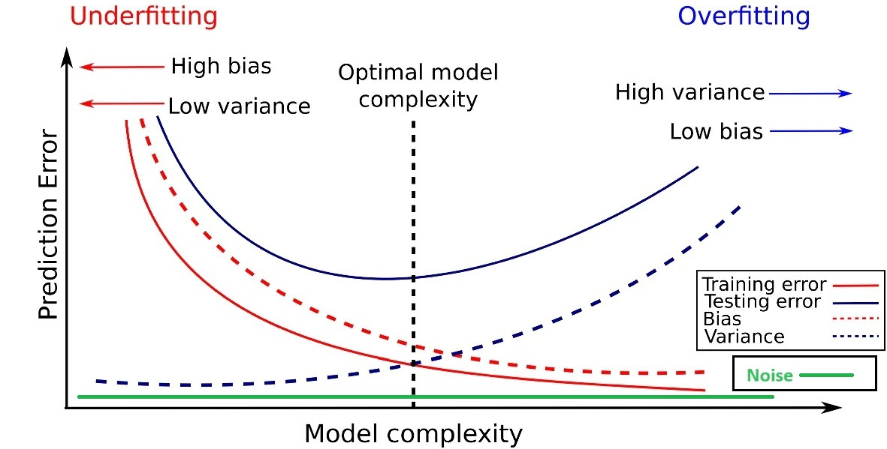

# Biase Variance tradeoff
## Introduction
Prior notions: underfitting, overfitting, generalization. Goal to find lowest possible generalization error. 
Training ML model to reduce objective function: $\sum_{i=1}^{m}\lVert f(x^{(i)train}) - y^{(i)train}\rVert_2^2$
Acheve lower error on test set (holdout)  $\sum_{i=1}^{m}\lVert f(x^{(i)test}) - y^{(i)test}\rVert_2^2$
We presume that training distribution ~ test distribution. 

*Image 1: Adopted from [paper](https://link.springer.com/article/10.1007/s10115-019-01335-4)*
## Data Parameters
With data available $\mathcal{Z}=\{(x^{(i)},y^{(i)})\}_i$ we assume they are i.i.d. - identically independently distributed. We want to fit some model $f(x; \theta,\Theta)$ for parameters $\theta$ and hyperparameters $\Theta$. 

!! Common mistake are various kinds of knowledge leak where information from holdout set leaks to choice of hyperparameters or parameters. 

!! Choosing hyperparameters (hp) on the dependent only of training set leads to high capacity models. To reduce these errors common way is to use Cross-Validation (CV) and holdout set. With CV hp can be estimated and yield biased solutions. CV( [Nested CV](https://www.jmlr.org/papers/volume11/cawley10a/cawley10a.pdf), [BBC-CV](https://github.com/mensxmachina/BBC-CV))

Lets say our real data are generated by some $f(\theta)$, to evaluate we use point wise $f(\^\theta)$ and choose hp that lead towards optimal solution. To evaluate the parameters of the real distribution generators we have measured data $\mathcal{Z}$. (Our measurements have errors and are prone to experimental error)

## Freqeuentist Bias and Variance
Looking at the parameters from statistics point of view they are $\hat\theta := g(\mathcal{Z})$ some statistics of the data. bias of this statistics is the difference defined as: $Bias[g(\mathcal{Z})] = \mathbb{E}[g(\mathcal{Z})] - \theta$ same for the Variance of these statistics
$Var[g(\mathcal{Z})] = \mathbb{E}[(g(\mathcal{Z}) - \theta)^2]$.

In example of $p ~ Bernoulli(\theta)$ that is $p$~$\{p(0)=1-\theta, p(1)=\theta\}$ with density function: $p(x^{(i)};\theta) =\theta^{x^{(i)}}(1-\theta)^{x^{(i)}}$ we say estimation of parameter $\^\theta = \frac{1}{m}\sum_i x^{(i)}$

Calculation of $Bias[g(\mathcal{Z})]$ and $Var[g(\mathcal{Z})]$. is ...

## Bias Variance trade-off
Mean square error $MSE = \mathbb{E}[(\mathbb{E}[\^\theta] - \theta)^2]$ but real parameters that produce the data can really never be measured are prone to basic noise $ $noise(\epsilon) = \mathbb{E}[-\theta'^2 + \theta^2]$ where $\theta$ is something uncertain, and has some confounding factor that is essential part of it. 

Calculation: ...

$MSE = \mathbb{E}[(\mathbb{E}[\^\theta] - \theta)^2] = Bias^2(\^\theta) + Var(\^\theta) + noise(\epsilon)$

